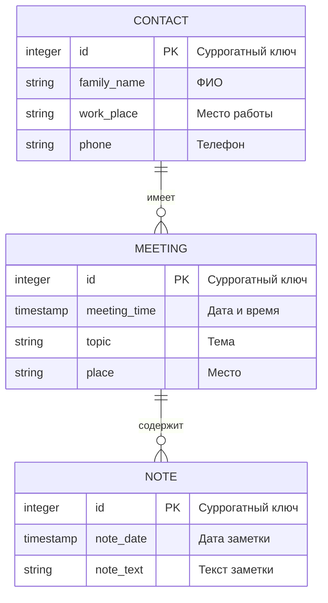
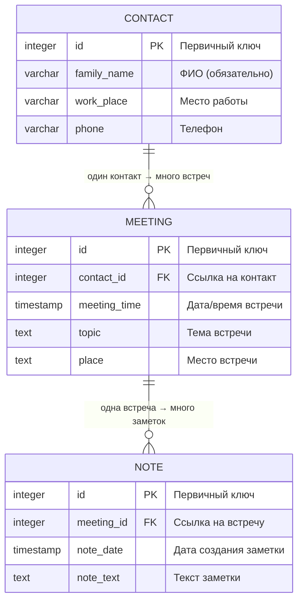
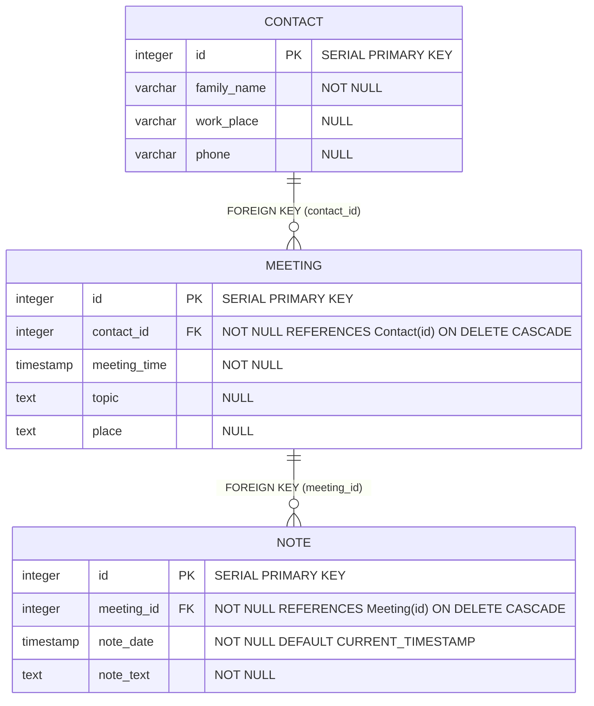

**Лабораторные работы по БД**

Перечень [лабораторных работ](https://edu.irnok.net/doku.php?id=db:main#%D0%BB%D0%B0%D0%B1%D0%BE%D1%80%D0%B0%D1%82%D0%BE%D1%80%D0%BD%D0%B0%D1%8F_%D1%80%D0%B0%D0%B1%D0%BE%D1%82%D0%B0_5_%D1%82%D1%80%D0%B8%D0%B3%D0%B3%D0%B5%D1%80%D1%8B)

Telegram: [at]eugeneai

Ссылка на НОВЫЙ чат Deepseek: https://chat.deepseek.com/share/qsw0aj5ur8x724w3mk

# Постановка задачи (вариант 65)

**Учет контактов и взаимодействий (личная CRM)**

*Сущности:* Контакты (ФИО, место работы, телефон), встречи (дата, тема, место), заметки (дата, текст заметки по контакту).

*Процессы:* Регистрируются все встречи и важные события, связанные с контактами.

*Выходные документы:*

  - Выдать список предстоящих встреч на неделю с указанием контактов и тем, отсортированный по дате и времени.
  - Для заданного контакта выдать историю всех встреч и заметок, отсортированную по дате.

# Лабораторная работа 1 (Проектирование логической и физической модели БД)

<Картинки>

## Промпт к Дипсик

Ссылка на чат:
https://chat.deepseek.com/share/54zhri5m87p2xoywp5

```text
Лаба по проектированию информационной модели для реляционных баз данных.
Предполагаем встречи с только одним контактом (Я и он).
 Предполагаем Postgresql. 
Есть ошибки, замечания, неточности?

# Учет контактов и взаимодействий (личная CRM)*

Дополнительные ограничения:
1. Можно организовать с одним контактом несколько встреч
2. Встречи только с одним контактом.
## Постановка задачи

*Сущности:*
    Контакты (ФИО, место_работы, телефон),
    Встречи (дата, тема, место),
    Заметки (дата, текст_заметки_по_контакту).

*Процессы:* (Отношения)
    Регистрируются все встречи и важные события, связанные с контактами.

*Выходные документы:*

  - Выдать список предстоящих встреч на неделю с указанием контактов и тем, отсортированный по дате и времени.

  - Для заданного контакта выдать историю всех встреч и заметок, отсортированную по дате.

## ER-Модель
### Базовые сущности

    Контакт(ФИО, место_работы, телефон), ключевой набор - телефон
    Встреча(время_встречи, тема, место), ключевой набор - время_встречи

### Отношения

    [Контакт]-1,Required------------------N,Optional-[Встреча]

    [Контакт]-N,Required-----Заметка------M,Optional-[Встреча]
                              текст

    Т.е. отношение "Заметка" содержит атрибут "текст_заметки_по_контакту"

## Логическая модель

Используя правило 1,Required -- N,Optional получаем две *таблицы*

  - ```Contact(family_name, work_place, phone)```, primary key - phone

  - ```Meeting(contact_phone, meeting_time, topic, place)```, primary key - meeting_time

Используя правило N,* -- M,* получаем итого три *таблицы*:

  - ```Contact(family_name, work_place, phone)```, primary key - phone
  - ```Meeting(contact_phone, meeting_time, topic, place)```, primary key - meeting_time
  - ```Note(pk, contact_phone, meeting_time, note)```, secondary key - (contact_phone, meeting_time)

## Физическая модель

Зададим типы данных для атрибутов:

  - ```family_name::varchar```
  - ```work_place::varchar```
  - ```phone::Decimal(10)```
  - ```meeting_time::datetime```
  - ```topic::text```
  - ```place::text```
  - ```pk::integer```
  - ```contact_phone::Decimal(10)```
  - ```note:text```

## Проверка нормальных форм

### Первая нормальная форма

Все значения всех атрибутов атомарные.

### Вторая нормальная форма

Выполняется: нет зависимостей неключевых атрибутов от части ключа

### Третья нормальная форма

Нет транзитивных зависимостей неключей от неключей

### Нормальная форма Бойса-Кодда

Не выполняется, т.к. note (в Note) зависит транзитивно от (contact_phone, meeting_time), а те от pk.
```
# Рестарт проекта с целью лучшего приближения к допущениям и качеству результата

# Отчет по проектированию информационной модели для реляционной БД "Личная CRM"

## Содержание
1. [Постановка задачи](#постановка-задачи)
2. [Концептуальная модель (ER)](#концептуальная-модель-er)
3. [Логическая модель](#логическая-модель)
4. [Физическая модель](#физическая-модель)
5. [SQL DDL](#sql-ddl)
6. [Примеры запросов](#примеры-запросов)
7. [Эволюция проекта](#эволюция-проекта)

## Постановка задачи

### Цель проекта
Разработать реляционную базу данных для учета личных контактов и взаимодействий (личная CRM система).

### Бизнес-требования
- Учет контактов с основной информацией
- Регистрация встреч с контактами
- Ведение заметок по встречам
- Формирование отчетов по предстоящим и прошедшим встречам

### Ограничения
- ✅ Одна встреча проводится только с одним контактом
- ✅ С одним контактом может быть организовано несколько встреч
- ✅ Заметки привязываются к конкретным встречам

### Выходные документы
1. Список предстоящих встреч на неделю с контактами и темами
2. История всех встреч и заметок для заданного контакта

## Концептуальная модель (ER)



### Описание сущностей
- **CONTACT** - информация о контактах (людях)
- **MEETING** - информация о запланированных и состоявшихся встречах  
- **NOTE** - текстовые заметки, сделанные во время или после встреч

## Логическая модель



### Связи между сущностями
- **Contact → Meeting**: 1:N (один ко многим)
- **Meeting → Note**: 1:N (один ко многим)

## Физическая модель

### Таблицы и типы данных PostgreSQL



### Индексы для оптимизации
```sql
-- Для быстрого поиска встреч по дате
CREATE INDEX idx_meeting_time ON Meeting(meeting_time);

-- Для быстрого поиска встреч по контакту  
CREATE INDEX idx_meeting_contact ON Meeting(contact_id);

-- Для быстрого поиска заметок по встрече
CREATE INDEX idx_note_meeting ON Note(meeting_id);
```

## SQL DDL

### Полный скрипт создания базы данных

```sql
-- Таблица контактов
CREATE TABLE Contact (
    id SERIAL PRIMARY KEY,
    family_name VARCHAR(100) NOT NULL,
    work_place VARCHAR(100),
    phone VARCHAR(20)
);

-- Таблица встреч
CREATE TABLE Meeting (
    id SERIAL PRIMARY KEY,
    contact_id INTEGER NOT NULL,
    meeting_time TIMESTAMP NOT NULL,
    topic TEXT,
    place TEXT,
    FOREIGN KEY (contact_id) REFERENCES Contact(id) ON DELETE CASCADE
);

-- Таблица заметок
CREATE TABLE Note (
    id SERIAL PRIMARY KEY,
    meeting_id INTEGER NOT NULL,
    note_date TIMESTAMP NOT NULL DEFAULT CURRENT_TIMESTAMP,
    note_text TEXT NOT NULL,
    FOREIGN KEY (meeting_id) REFERENCES Meeting(id) ON DELETE CASCADE
);

-- Создание индексов для оптимизации запросов
CREATE INDEX idx_meeting_time ON Meeting(meeting_time);
CREATE INDEX idx_meeting_contact ON Meeting(contact_id);
CREATE INDEX idx_note_meeting ON Note(meeting_id);
```

## Примеры запросов

### 1. Предстоящие встречи на неделю

```sql
SELECT 
    m.meeting_time as "Дата и время",
    c.family_name as "Контакт",
    m.topic as "Тема",
    m.place as "Место"
FROM Meeting m
JOIN Contact c ON m.contact_id = c.id
WHERE m.meeting_time BETWEEN CURRENT_DATE AND CURRENT_DATE + INTERVAL '7 days'
ORDER BY m.meeting_time;
```

### 2. История встреч и заметок по контакту

```sql
-- Для контакта с ID = 1
SELECT 
    m.meeting_time as "Дата",
    'Встреча' as "Тип",
    m.topic as "Тема/Заметка",
    m.place as "Место",
    NULL as "Текст заметки"
FROM Meeting m
WHERE m.contact_id = 1

UNION ALL

SELECT 
    n.note_date as "Дата",
    'Заметка' as "Тип", 
    'Заметка к встрече: ' || m.topic as "Тема/Заметка",
    NULL as "Место",
    n.note_text as "Текст заметки"
FROM Note n
JOIN Meeting m ON n.meeting_id = m.id
WHERE m.contact_id = 1

ORDER BY "Дата" DESC;
```

### 3. Поиск контактов по месту работы

```sql
SELECT 
    family_name as "ФИО",
    work_place as "Место работы", 
    phone as "Телефон"
FROM Contact
WHERE work_place ILIKE '%компания%'
ORDER BY family_name;
```

## Эволюция проекта

### Ключевые решения и исправления

#### 1. Выбор первичных ключей
- **Было**: Использование телефонного номера и времени встречи как PK
- **Стало**: Введение суррогатных ключей `id SERIAL PRIMARY KEY`
- **Причина**: Обеспечение стабильности, неизменяемости и уникальности идентификаторов

#### 2. Нормализация структуры
- **Было**: Избыточная связь Note с Contact и Meeting
- **Стало**: Чистая иерархия Contact → Meeting → Note
- **Причина**: Устранение транзитивных зависимостей и избыточности данных

#### 3. Типы данных
- **Было**: `phone::Decimal(10)`
- **Стало**: `phone::VARCHAR(20)`
- **Причина**: Поддержка международных форматов номеров и специальных символов

### Проверка нормальных форм

| Нормальная форма | Состояние | Комментарий |
|------------------|-----------|-------------|
| 1NF | ✅ Выполнена | Все атрибуты атомарны |
| 2NF | ✅ Выполнена | Нет зависимостей от части ключа |
| 3NF | ✅ Выполнена | Нет транзитивных зависимостей |
| BCNF | ✅ Выполнена | Все детерминанты - потенциальные ключи |

### Преимущества финальной модели

1. **Гибкость**: Легко расширяется новыми полями и сущностями
2. **Производительность**: Оптимизированные индексы для частых запросов
3. **Целостность**: FOREIGN KEY constraints гарантируют согласованность данных
4. **Масштабируемость**: Четкая нормализованная структура
5. **Поддержка**: Удобство администрирования и разработки

---

## Выполнение запросов вручную

>> Выдать список предстоящих встреч на неделю с указанием контактов и тем, отсортированный по дате и времени.

```sql
SELECT c.family_name AS "ФИО", c.work_place AS "Учреждение", c.phone AS "Тел.",
m.topic AS "Тема", m.place AS "Место", m.meeting_time
FROM eugeneai.meeting AS m
JOIN eugeneai.contact AS c ON c.id = m.contact_id 
WHERE m.meeting_time BETWEEN '2025-11-11 12:41:00' AND '2025-11-11 12:41:59'
ORDER BY m.meeting_time;
```

|ФИО	|Учреждение	|Тел.	|Тема	|Место	meeting_time|
|-----|-----------|-----|-----|-------------------|
|Sam Clinton	|МИТ	+1(234)5678900	|Подготовка научной статьи	|Washington DC, 1st str., 28-51	|2025-11-11 12:41:09.029324|
|Sam Clinton	|МИТ	+1(234)5678900	|Проведение экспериментов на животных	|Washington DC, 1st str., lab. 20	|2025-11-11 12:41:53.276792|


**Запрос от Дипсик**

```sql
SELECT 
    m.meeting_time as "Дата и время",
    c.family_name as "Контакт",
    m.topic as "Тема",
    m.place as "Место"
FROM eugeneai.Meeting m
JOIN eugeneai.Contact c ON m.contact_id = c.id
WHERE m.meeting_time BETWEEN CURRENT_DATE - INTERVAL '7 days' AND CURRENT_DATE + INTERVAL '7 days'
ORDER BY m.meeting_time;
```

```text
Дата и время	Контакт	Тема	Место
2025-11-11 12:41:09.029324	Sam Clinton	Подготовка научной статьи	Washington DC, 1st str., 28-51
2025-11-11 12:41:53.276792	Sam Clinton	Проведение экспериментов на животных	Washington DC, 1st str., lab. 20
2025-11-11 12:42:51.366582	John Lee	Продление контракта с НАСА	New-York, 30th ave., N 20-45
2025-11-11 12:43:41.886128	John Wang	Обсуждение результатов скдебного заседания от 2025-11-11	New-York, 30th ave., N 20-45
```


### Vew для этого запроса 

```sql
-- Выдать список предстоящих встреч на неделю 
-- с указанием контактов и тем, отсортированный по дате и времени.
CREATE OR REPLACE VIEW two_weeks_meetings
AS
SELECT 
    m.meeting_time as "Дата и время",
    c.family_name as "Контакт",
    m.topic as "Тема",
    m.place as "Место"
FROM eugeneai.Meeting m
JOIN eugeneai.Contact c ON m.contact_id = c.id
WHERE m.meeting_time BETWEEN CURRENT_DATE - INTERVAL '7 days' AND CURRENT_DATE + INTERVAL '7 days'
ORDER BY m.meeting_time;
```

**Проверка**

```sql
SELECT * FROM eugeneai.two_weeks_meetings
WHERE "Контакт" LIKE 'S%m%';
```

```text
Дата и время	Контакт	Тема	Место
2025-11-11 12:41:09.029324	Sam Clinton	Подготовка научной статьи	Washington DC, 1st str., 28-51
2025-11-11 12:41:53.276792	Sam Clinton	Проведение экспериментов на животных	Washington DC, 1st str., lab. 20
```


## Анализ на 4НФ, 5НФ, Индексы

## Проверка 4НФ (Четвертая нормальная форма)

**4НФ требует:** Отсутствие многозначных зависимостей, не являющихся функциональными зависимостями от ключа.

### Анализ таблиц:

#### 1. Таблица `contact`
```sql
CREATE TABLE eugeneai.contact (
    id integer PRIMARY KEY,
    family_name varchar(100) NOT NULL,
    work_place varchar(100),
    phone varchar(20)
);
```

**✅ Соответствует 4НФ:**
- Нет многозначных зависимостей
- Все атрибуты функционально зависят от первичного ключа `id`
- Нет независимых многозначных фактов о контакте

#### 2. Таблица `meeting`
```sql
CREATE TABLE eugeneai.meeting (
    id integer PRIMARY KEY,
    contact_id integer NOT NULL,
    meeting_time timestamp NOT NULL,
    topic text,
    place text
);
```

**✅ Соответствует 4НФ:**
- Все атрибуты функционально зависят от первичного ключа `id`
- Нет многозначных зависимостей
- Встреча определяется полностью своим ID

#### 3. Таблица `note`
```sql
CREATE TABLE eugeneai.note (
    id integer PRIMARY KEY,
    meeting_id integer NOT NULL,
    note_date timestamp DEFAULT CURRENT_TIMESTAMP NOT NULL,
    note_text text NOT NULL
);
```

**✅ Соответствует 4НФ:**
- Все атрибуты функционально зависят от первичного ключа `id`
- Нет многозначных зависимостей
- Каждая заметка - отдельный факт

## Проверка 5НФ (Пятая нормальная форма)

**5НФ требует:** Отсутствие зависимостей соединения, которые не следуют из ключевых ограничений.

### Анализ на наличие зависимостей соединения:

#### 1. Проверка декомпозиции без потерь

**Таблица `contact`:**
- Не может быть декомпозирована без потерь
- Все атрибуты взаимосвязаны через первичный ключ
- **✅ Соответствует 5НФ**

**Таблица `meeting`:**
- Не может быть декомпозирована без потерь
- Все атрибуты определяются встречей как целым
- **✅ Соответствует 5НФ**

**Таблица `note`:**
- Не может быть декомпозирована без потерь
- Заметка - атомарная сущность
- **✅ Соответствует 5НФ**

### 2. Проверка на избыточные соединения

В текущей схеме нет таблиц, которые:
- Содержат независимые факты, требующие разделения
- Имеют составные ключи с независимыми семантиками
- Требуют восстановления через нетривиальные соединения

## Потенциальные проблемы и рекомендации

### 1. Временные зоны
```sql
-- meeting_time - timestamp without time zone
-- note_date - timestamp with time zone
```
**Рекомендация:** Унифицировать использование временных зон для согласованности.

### 2. Ограничения уникальности
**Отсутствуют:**
- Уникальность телефона в `contact`
- Проверка формата телефона

**Рекомендация:**
```sql
ALTER TABLE eugeneai.contact ADD CONSTRAINT unique_phone UNIQUE (phone);
ALTER TABLE eugeneai.contact ADD CONSTRAINT phone_format CHECK (phone ~ '^\+?[0-9\s\-\(\)]+$');
```

### 3. Индексы
**✅ Достаточно:** Существующие индексы покрывают основные сценарии запросов.

## Итоговый вердикт

| Нормальная форма | Состояние | Обоснование |
|------------------|-----------|-------------|
| **1НФ** | ✅ Выполнена | Все атрибуты атомарны |
| **2НФ** | ✅ Выполнена | Полная функциональная зависимость от ключей |
| **3НФ** | ✅ Выполнена | Нет транзитивных зависимостей |
| **BCNF** | ✅ Выполнена | Все детерминанты - ключи |
| **4НФ** | ✅ Выполнена | Нет многозначных зависимостей |
| **5НФ** | ✅ Выполнена | Нет зависимостей соединения |

## Заключение

**База данных полностью соответствует 4НФ и 5НФ.**

### Преимущества текущей схемы:
1. **Полная нормализация** - до 5НФ включительно
2. **Отсутствие избыточности** - нет дублирования данных
3. **Целостность связей** - правильные внешние ключи
4. **Оптимизированная структура** - подходящие индексы
5. **Масштабируемость** - легко расширять новыми функциями

### Дополнительные рекомендации:
1. Добавить ограничения уникальности для телефонов
2. Унифицировать использование временных зон
3. Рассмотреть добавление проверочных ограничений для данных

**Вериликт Дипсик: Ваша схема является отличным примером правильно спроектированной реляционной базы данных!** 🎉


Ссылка на чат: https://chat.deepseek.com/share/qsw0aj5ur8x724w3mk


